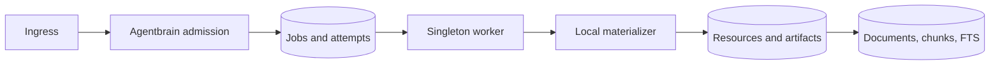

## Overview

Establish Agentbrain as the sole durable ingestion authority: a typed resource/provenance model, immutable jobs and attempts, content-addressed artifacts, queued public admission, a fenced worker, operator controls, and collection-aware retrieval. Every currently supported text, file, directory, and URL intent must become durable before materialization while preserving the structurally read-only query boundary and the existing database path.

## Quick commands

- `bun test`
- `AGENTBRAIN_DB=$(mktemp -u)/brain.db agentbrain submit --kind text --wait "durable hello"`
- `agentbrain jobs list --state blocked --json && agentbrain doctor --json`

## Acceptance

- [ ] Every valid public ingestion intent creates or identifies a durable job before parsing, extraction, or indexing.
- [ ] Resource, artifact, source, collection, observation, run, job, attempt, and provenance state has additive migration coverage preserving legacy documents and FTS.
- [ ] Lease expiry, fencing, retry, blocking, cancellation, exclusion, idempotent replay, and crash-window reconciliation are observable and tested offline.
- [ ] Local file content is snapshotted into the artifact store before asynchronous processing.
- [ ] Read-only commands cannot mutate schema, queue, artifacts, or index state.
- [ ] Collection/source/kind/sensitivity filters work without weakening exact lexical search.

## Early proof point

Task 2 proves the approach by atomically claiming and fencing jobs against a temporary SQLite database. If it fails, keep the resource migration from Task 1 and redesign the queue claim primitive before building admission or workers.

## References

- `CONTEXT.md`
- `docs/adr/0003-agentbrain-owns-durable-ingestion.md`
- `docs/adr/0004-durable-ingestion-job-lifecycle.md`
- `docs/adr/0005-public-ingestion-admission-contract.md`
- `docs/adr/0006-conservative-resource-identity.md`
- `docs/adr/0008-content-addressed-artifact-storage.md`
- `docs/adr/0011-single-worker-source-scheduling.md`
- `docs/adr/0012-local-security-and-sensitive-ingestion.md`

## Docs gaps

- **README.md**: replace synchronous-ingestion and obsolete queue ownership guidance with implemented admission, jobs, worker, artifact, and operator behavior.
- **CLI help/guide/prompt surfaces**: document stable machine envelopes and safe inspection semantics.

## Best practices

- **At-least-once effects:** combine stable idempotency keys with atomic fenced completion rather than claiming exactly-once execution. [AWS Builders' Library]
- **Short SQLite writes:** perform materialization outside transactions and use atomic claims plus bounded busy handling. [SQLite locking]
- **Sensitive derivation:** inherit sensitivity before search, preview, export, or future embeddings. [OWASP data handling]

## Alternatives

- Keep Scrapectl as the ingestion queue: rejected because non-URL inputs, source runs, and index completion would have split lifecycle authority.
- Add an external broker: rejected because a local single-user SQLite system does not justify another service.

## Architecture

## Rollout

Apply the additive migration first against temporary and legacy-filled fixtures. Install the worker only after admission/operator tests pass; keep live source scheduling disabled until later epics. Preserve `~/.hermes/research-cache/research.db` and roll back through the pre-migration snapshot plus Git revert.
