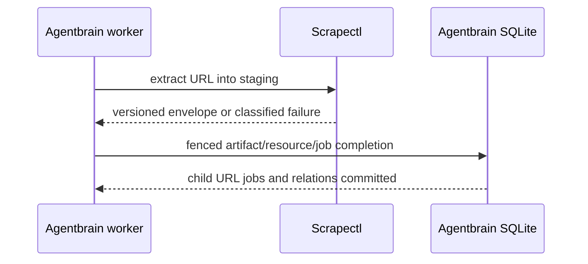

## Overview

Replace Agentbrain-targeted Scrapectl queue handoffs and provider-shaped completed payloads with one synchronous, versioned extraction envelope consumed by Agentbrain's durable worker. URL jobs, X roots, and every eligible outbound resource remain independently queued and inspectable while Scrapectl retains all web/browser/provider implementation.

## Quick commands

- `cd /Users/mike/code/arthack && uv run pytest apps/scrapectl/tests -q`
- `cd /Users/mike/code/agentbrain && bun test`
- `AGENTBRAIN_DB=$(mktemp -u)/brain.db agentbrain submit --kind url https://example.com/ && agentbrain worker --once`

## Acceptance

- [ ] Scrapectl exposes a bounded provider-neutral extraction envelope with stable success and failure classes.
- [ ] Agentbrain URL jobs invoke Scrapectl outside SQLite transactions and finalize through fenced idempotent worker completion.
- [ ] X root completion transactionally records typed outbound relations, suppressions, and independent child jobs.
- [ ] No production Agentbrain source implements HTTP, DNS, browser, redirect, preset, or provider-schema fallback.
- [ ] Normal suites remain fully offline; live extraction is opt-in and temporary-state only.

## Early proof point

Task 1 proves that Scrapectl can render a provider-neutral envelope from existing generic/X fixtures without leaking provider schemas. If it fails, revise the envelope at the extractor boundary before changing Agentbrain workers.

## References

- `docs/adr/0002-scrapectl-owns-url-extraction.md`
- `docs/adr/0007-synchronous-scrapectl-extraction-contract.md`
- `docs/adr/0009-durable-source-fanout-and-checkpoints.md`
- `/Users/mike/code/arthack/apps/scrapectl/README.md`

## Docs gaps

- **Agentbrain README/help**: document queued URL behavior, child-job semantics, and opt-in live smoke.
- **Scrapectl README**: document the versioned extraction envelope and remove Agentbrain queue-ownership implications after cutover.

## Best practices

- **Protocol versioning:** reject unknown envelopes rather than guessing provider fields.
- **SSRF ownership:** keep redirect/DNS/private-address enforcement exclusively in Scrapectl. [OWASP SSRF]
- **Independent children:** store relations separately instead of concatenating destination content into X roots. [W3C PROV]

## Alternatives

- Keep the existing completed-link payload: rejected because recursive provider-field discovery is unstable and child work is not durable.
- Put web transport in Agentbrain: rejected by the extraction security boundary.

## Architecture

## Rollout

Land the Scrapectl envelope before enabling Agentbrain URL dispatch. Keep the old Agentbrain-targeted YAML handoff only until the cutover epic migrates its remaining failed job; do not dual-complete one ingestion through both paths.
