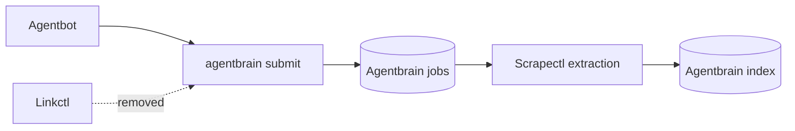

## Overview

Move human saved-link ingress from Linkctl to Agentbrain's durable submission contract, reconcile the old Scrapectl Agentbrain queue, retire compatibility adapters, and delete Linkctl from Arthack. Preserve the ordered legacy corpus and historical provenance as data while eliminating every live Linkctl or research-cache ingestion dependency.

## Quick commands

- `cd /Users/mike/code/agentbot && bun test`
- `cd /Users/mike/code/arthack && uv run pytest apps/scrapectl/tests -q`
- `rg -n '\blinkctl\b|research-ingest-link|research-cache' /Users/mike/code/agentbot /Users/mike/code/agentbrain /Users/mike/code/arthack`

## Acceptance

- [ ] Agentbot submits saved URLs to Agentbrain and preserves queued/duplicate user responses.
- [ ] Every pending or failed old Scrapectl Agentbrain job is imported, drained, or explicitly dispositioned before old handoffs disappear.
- [ ] Linkctl source, packaging, installation, symlink/config ownership, and live references are removed from Arthack.
- [ ] Agentbrain compatibility ingestion executables and old partial-success contracts are removed after producers migrate.
- [ ] `~/content/links`, exact catalog order, artifacts, and historical `source=linkctl` evidence remain byte-preserved.

## Early proof point

Task 1 proves the user-facing cutover by replacing Agentbot's exact argv and duplicate contract against a fake Agentbrain CLI. If it fails, keep Linkctl installed and fix the Agentbrain admission envelope before touching queue migration or deletion.

## References

- `docs/adr/0005-public-ingestion-admission-contract.md`
- `docs/adr/0007-synchronous-scrapectl-extraction-contract.md`
- `/Users/mike/code/agentbot/src/behaviors/save-links.ts`
- `/Users/mike/code/arthack/apps/linkctl/linkctl/api.py`

## Docs gaps

- **Agentbot README/docs/behaviors.md**: replace Linkctl external contract with Agentbrain admission.
- **Agentbrain README/help**: remove compatibility adapter and old partial-result guidance.
- **Hermes README/architecture/references/twitter PRD**: remove obsolete queue/admission ownership while preserving non-writing boundaries.

## Best practices

- **Single writer at cutover:** quiesce old ingress and reconcile before deleting paths; never dual-write. [AWS migration cutover guidance]
- **Rollback evidence:** rely on Git and verified snapshots, not a hidden compatibility shim.

## Alternatives

- Retain Linkctl as an admission facade: rejected by the human; collection membership and idempotency now belong to Agentbrain.
- Delete Linkctl before Agentbot switches: rejected because it creates a user-visible ingestion outage.

## Architecture

## Rollout

Snapshot and reconcile first, switch Agentbot, prove queued/duplicate/success/failure behavior, then remove old handoffs and Linkctl. A failure before deletion keeps old code quiesced for diagnosis; a failure after deletion rolls back with Git plus snapshots, never dual-writing.
