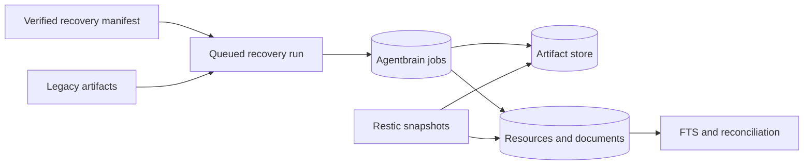

## Overview

Make the recovered corpus safe and reproducible to restore: consistent Agentbrain snapshots, complete encrypted Restic coverage, a manifest-driven queued importer, Markdown-aware chunks, and a disposable rehearsal proving exact cohort accounting. This epic creates tooling and evidence only; the following operational epic mutates the live database.

## Quick commands

- `bun test`
- `agentbrain backup create --destination "$(mktemp -d)" --json`
- `agentbrain recovery import --manifest ~/docs/agentbrain-recovery-manifest-2026-07-15.jsonl --dry-run --json`

## Acceptance

- [ ] A consistent restorable SQLite snapshot and artifact manifest can be produced while the worker is safely quiesced or coordinated.
- [ ] B2 and Silverbird backups cover the live DB snapshot, artifact store, link corpus, public manifests, and private recovery tree without exposing secrets.
- [ ] Recovery import is queued, offline, hash-verifying, idempotent, resumable, and exact about all 1,075 candidate outcomes.
- [ ] Approved Markdown is chunked deterministically by structure and remains rebuildable from artifacts.
- [ ] A disposable rehearsal proves 584 ordered memberships, 581 offline completions, blocked review cohorts, exclusions, rollback, FTS, and citations.

## Early proof point

Task 1 proves a consistent snapshot/restore against a running-style temporary database. If it fails, stop before changing backup source lists or admitting any recovery jobs.

## References

- `docs/adr/0008-content-addressed-artifact-storage.md`
- `docs/adr/0010-legacy-recovery-import-contract.md`
- `~/docs/agentbrain-recovery-manifest-2026-07-15.jsonl`
- `~/docs/agentbrain-recovery-report-2026-07-15.md`
- `~/content/links/links.yaml`

## Docs gaps

- **README/help**: document backup snapshot, dry-run import, reconciliation output, and the distinction between tooling and live execution.
- **Dotfiles backup notes**: state covered Agentbrain roots and restore verification without recording credentials.

## Best practices

- **Consistent SQLite backup:** never treat a copied live DB/WAL pair as verified state; use an online snapshot mechanism and integrity check. [SQLite backup guidance]
- **Semantic reconciliation:** compare candidate IDs, hashes, memberships, provenance, and searchability rather than row count alone.
- **Structure-aware chunks:** preserve headings, lists, code fences, tables, and deterministic anchors before adding embeddings.

## Alternatives

- Directly ingest the `content/links` directory: rejected because hashed filenames and frontmatter would replace original URL identity.
- Re-fetch the corpus: rejected because 581 approved artifacts are available offline and historical bytes matter.

## Architecture

## Rollout

Land snapshot/backup support first, verify both repositories, then rehearse against temporary state using the real manifest and read-only artifacts. Do not touch the live DB or perform any network fetch in this epic.
