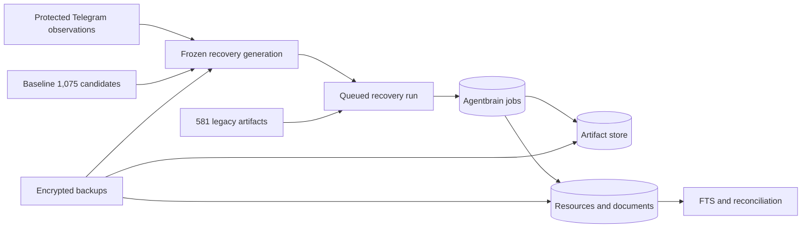

## Overview

Make the recovered corpus safe and reproducible to restore: consistent Agentbrain snapshots, a frozen Telegram-enriched recovery generation, complete encrypted Restic coverage, a manifest-driven queued importer, Markdown-aware chunks, and a disposable rehearsal proving exact cohort accounting. This epic creates tooling and evidence only; it consumes the already completed bounded Telegram observation pass, performs no new fetch, and leaves live database mutation to the following operational epic.

## Quick commands

- `bun test`
- `shasum -a 256 -c ~/.local/share/agentbrain/recovery/SHA256SUMS`
- `agentbrain backup create --destination "$(mktemp -d)" --json`
- `agentbrain recovery import --manifest-generation ~/.local/share/agentbrain/recovery/manifests/current.json --dry-run --json`

## Acceptance

- [ ] A consistent restorable SQLite snapshot and artifact manifest can be produced while the worker is safely quiesced or coordinated.
- [ ] One hash-addressed generation reconciles 294 Secretary URL observations into 131 exact URLs, merges provenance into 118 existing candidates, appends 13 candidates without normalized-URI collapse, and accounts for 1,088 outcomes.
- [ ] B2 and Silverbird backups cover the live DB snapshot, artifact store, link corpus, frozen manifests, and protected recovery evidence while excluding Telegram session credentials and disposable working copies.
- [ ] Recovery import is queued, offline, hash-verifying, idempotent, resumable, and exact about all 1,088 candidate outcomes.
- [ ] Approved Markdown is chunked deterministically by structure and remains rebuildable from artifacts.
- [ ] A disposable rehearsal proves 584 ordered memberships, 581 offline completions, two non-runnable approved-online jobs, blocked review cohorts, exclusions, rollback, FTS, and citations without network access.

## Early proof point

Task 6 proves the Telegram evidence can become one deterministic, body-free, internally balanced generation after Task 1 provides safe snapshot primitives. If it fails, retain the baseline 1,075-candidate manifest and stop before backup publication, importer dry-run, or any live admission.

## References

- `docs/adr/0008-content-addressed-artifact-storage.md`
- `docs/adr/0010-legacy-recovery-import-contract.md`
- `docs/adr/0012-local-security-and-sensitive-ingestion.md`
- `~/.local/share/agentbrain/recovery/telegram/secretary-link-summary-2026-07-18.json`
- `~/.local/share/agentbrain/recovery/telegram/secretary-link-index-2026-07-18.jsonl`
- `~/docs/agentbrain-recovery-manifest-2026-07-15.jsonl`
- `~/content/links/links.yaml`
- `fn-5-execute-approved-corpus-import` consumes the frozen generation and exact totals produced here.

## Docs gaps

- **README/help**: document generation-based dry-run/import, sanitized reconciliation output, and the boundary between offline recovery and approved online backfill.
- **Dotfiles backup notes**: state covered Agentbrain evidence roots, explicit Telegram credential exclusions, and restore verification without recording private identifiers.
- **Count-only recovery summary**: publish aggregate Telegram reconciliation and hashes without message bodies, chat identifiers, exact URLs, or session paths.

## Best practices

- **Frozen generations:** bind immutable inputs, cutoff metadata, candidate manifest, summaries, and checksums under one generation ID; publish atomically and never rewrite the last complete generation.
- **Exact before comparison:** preserve exact URLs and observations independently; normalized forms are advisory reconciliation evidence, not identity or candidate collapse.
- **Purpose-limited privacy:** Secretary DM is normal saved-link ingress, while bodies, credentials, session material, and unnecessary chat identifiers stay private.
- **Network-denied rehearsal:** use synthetic fixtures and a forbidden Scrapectl so ordinary tests and recovery rehearsal cannot fetch.

## Alternatives

- Directly ingest the `content/links` directory: rejected because hashed filenames and frontmatter would replace original URL identity.
- Re-run Telegram during import: rejected because recovery must consume the already bounded, fixed evidence rather than a moving credential-bearing provider window.
- Collapse candidates by normalized URI: rejected because five exact-new URLs have comparison matches and still require independent outcomes.

## Architecture

## Rollout

Land snapshot support, freeze and checksum the composite 1,088-candidate generation, then verify both encrypted repositories before importer and rehearsal work proceeds. Rehearsal consumes frozen inputs in temporary roots with network disabled. No task in this epic fetches Telegram or candidate URLs; the two human-approved URL jobs remain non-runnable for the downstream controlled online phase.
