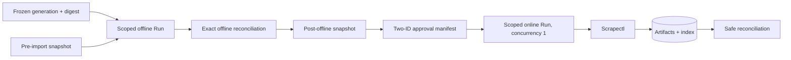

## Overview

Execute the approved recovery against live Agentbrain state in two deliberately separate runs. First verify the frozen 1,088-candidate generation, snapshot live state, admit every candidate, and drain only the 581 offline artifacts; after exact reconciliation and a second rollback snapshot, execute a run-scoped, concurrency-one Scrapectl backfill for exactly two human-approved Secretary submissions. Bot-output, test, review, and unrelated queue work remain non-runnable.

## Quick commands

- `agentbrain backup create --destination ~/.local/share/agentbrain/recovery/snapshots/pre-legacy-import --json`
- `agentbrain recovery import --manifest-generation ~/.local/share/agentbrain/recovery/manifests/current.json --expected-digest "$GENERATION_DIGEST" --dry-run --json`
- `agentbrain worker --run "$OFFLINE_RUN_ID" --allowed-kind recovery_offline --once`
- `agentbrain recovery backfill --approval ~/.local/share/agentbrain/recovery/manifests/online-allowlist.json --expected-generation "$GENERATION_DIGEST" --wait --json`
- `agentbrain stats --json && agentbrain jobs stats --json && agentbrain doctor --json`

## Acceptance

- [ ] Verified encrypted backups, a pre-import snapshot, exact generation digest, DB/artifact integrity, and run-scoped execution support exist before live mutation.
- [ ] All 1,088 candidates, 294 Telegram observations, and 584 ordered memberships receive the locked dispositions, with 118 provenance-only merges and no candidate collapse.
- [ ] Exactly 581 approved local artifacts are eligible for the offline run; scoped claims and denied URL kinds prove zero egress and zero unrelated-job execution.
- [ ] A verified post-offline snapshot and exact reconciliation gate a separate online Run whose immutable allowlist contains exactly the two human-approved candidate evidence row IDs.
- [ ] The online Run uses concurrency one and Scrapectl-only extraction; five bot-output candidates, 12 probable tests, and every other review/excluded/unrelated job remain untouched.
- [ ] Search, citations, provenance, queue/attempt history, artifacts, FTS, backup verification, and rollback evidence are complete and content-safe.

## Early proof point

Task 2 proves run-scoped claims can drain only a pinned run and allowed job kinds while an unrelated due job remains untouched. If that isolation fails, stop before either live recovery run; queue-wide hope and broad `worker --once` are not acceptable substitutes.

## References

- `docs/adr/0004-durable-ingestion-job-lifecycle.md`
- `docs/adr/0007-synchronous-scrapectl-extraction-contract.md`
- `docs/adr/0010-legacy-recovery-import-contract.md`
- `docs/adr/0011-single-worker-source-scheduling.md`
- `docs/adr/0012-local-security-and-sensitive-ingestion.md`
- `~/.local/share/agentbrain/recovery/manifests/current.json`
- `~/.local/share/agentbrain/recovery/SHA256SUMS`
- `fn-6-operate-recurring-knowledge-sources` remains blocked until both runs reconcile.
- `fn-3-cut-over-agentbot-ingestion` overlaps live queue draining, so this epic remains ordered after cutover.

## Docs gaps

- **README/help**: document immutable-generation pinning, scoped offline execution, the separately authorized two-link online run, safe state inspection, and resume behavior without showing private URLs.
- **Operational evidence**: record commands, generation/run/snapshot digests, opaque IDs, counts, states, attempts, and sanitized failure classes; never bodies, exact unsafe URLs, or Telegram identifiers.

## Best practices

- **Immutable authorization tuple:** bind the online run to one generation digest and exactly two opaque candidate evidence row IDs; any cardinality, digest, disposition, or identity mismatch fails before egress.
- **Scoped claims, not mutable queries:** generic workers skip operator-controlled runs; scoped workers claim only the pinned run and allowed kinds while the ordinary worker is quiesced.
- **Separate rollback points:** preserve the offline corpus when an online item fails; a snapshot can restore local effects but cannot undo a remote request.
- **Single retry owner:** Agentbrain owns durable retries and Scrapectl performs one bounded extraction attempt per lease.

## Alternatives

- Broad `worker --once` with an allegedly quiet queue: rejected because new ingress or an existing due job can widen execution.
- One mixed offline/online run: rejected because it obscures zero-egress proof, authorization, retries, rollback, and reconciliation.
- Fetch all Secretary-visible links: rejected because only two human submissions are approved; generated bot output and tests do not prove save intent.

## Architecture

## Rollout

Keep the ordinary LaunchAgent worker quiesced during both controlled windows. Admit and drain only the offline run, reconcile all outcomes, verify integrity/search, and create a post-offline snapshot. Then validate the immutable two-ID approval manifest and execute the online run serially. Item-specific terminal failure does not roll back its sibling; shared infrastructure, auth/config, generation, or integrity failure pauses the phase. Resume ordinary ingress only after scoped leases and reconciliation are clean.
