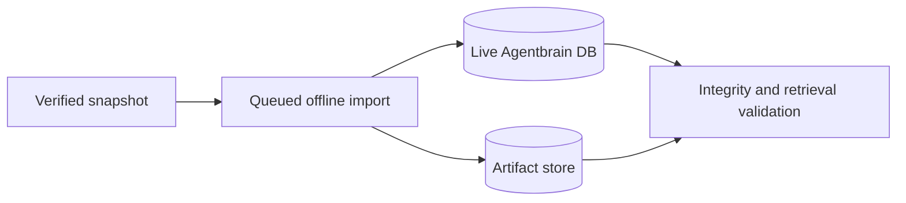

## Overview

Execute the approved offline recovery against the live Agentbrain state after tooling, backup, and disposable rehearsal have landed. Preserve an exact pre-import rollback point, import only the locked cohorts, drain all offline jobs, and capture sanitized evidence proving corpus, provenance, queue, artifact, FTS, and restore integrity.

## Quick commands

- `agentbrain backup create --destination ~/.local/share/agentbrain/recovery/snapshots/pre-legacy-import --json`
- `agentbrain recovery import --manifest ~/docs/agentbrain-recovery-manifest-2026-07-15.jsonl --dry-run --json`
- `agentbrain recovery import --manifest ~/docs/agentbrain-recovery-manifest-2026-07-15.jsonl --wait --json`
- `agentbrain stats --json && agentbrain jobs stats --json && agentbrain doctor --json`

## Acceptance

- [ ] A verified pre-import DB/artifact snapshot and current encrypted backup exist before mutation.
- [ ] All 1,075 candidates and 584 ordered catalog memberships receive the locked dispositions.
- [ ] Every valid approved artifact job completes offline; review and excluded cohorts create no network fetch.
- [ ] Search, citations, collection filters, provenance, queue history, artifacts, and integrity checks pass against live state.
- [ ] Rollback instructions and sanitized outcome evidence are complete without private bodies.

## Early proof point

Task 1 first runs exact dry-run and snapshot verification. Any count, hash, backup, or path mismatch stops before live admission and returns to the recovery-tooling epic for correction.

## References

- `docs/adr/0010-legacy-recovery-import-contract.md`
- `~/docs/agentbrain-recovery-manifest-2026-07-15.jsonl`
- `~/docs/agentbrain-recovery-report-2026-07-15.md`
- `~/.local/share/agentbrain/recovery/SHA256SUMS`

## Best practices

- **Fail closed before mutation:** exact dry-run and verified rollback are gates, not advisory checks.
- **Record semantic outcomes:** candidate dispositions and provenance matter more than matching historical row IDs.

## Alternatives

- Leave the corpus external: rejected because the approved goal is searchable Agentbrain recovery.
- Fetch missing/review candidates during import: rejected because evidence is not approval and historical bytes exist for the offline cohort.

## Architecture

## Rollout

Stop on any preflight discrepancy. After import, retain the pre-import snapshot through a verified backup cycle; rollback restores DB and artifact references together. Missing/fetch/retry cohorts remain blocked for later human disposition.
