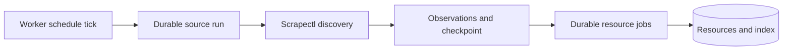

## Overview

Deliver operational recurring ingestion for the 11 confirmed blog sources and 14 confirmed X accounts using the same durable source runs, jobs, artifacts, provenance, and worker lifecycle as every other ingestion. Add feed/archive discovery to Scrapectl, source registry/checkpoints to Agentbrain, safe scheduling and health controls, then validate and activate forward polling without claiming unsupported deep X backfill.

## Quick commands

- `cd /Users/mike/code/arthack && uv run pytest apps/scrapectl/tests -q`
- `agentbrain sources list --json && agentbrain sources status --json`
- `agentbrain sources sync --due --dry-run --json`
- `agentbrain worker --once && agentbrain jobs stats --json`

## Acceptance

- [ ] Confirmed blog and X source definitions are versioned, inspectable, pausable, and scheduled through durable source-run jobs.
- [ ] Scrapectl exclusively discovers remote feed/archive/timeline items and emits bounded provider-neutral results.
- [ ] Source checkpoints advance only after complete discovery windows have durable admission or suppression outcomes.
- [ ] Daily blogs and hourly X polling resume safely across sleep, restart, overlap, partial discovery, and duplicate items.
- [ ] Thirteen recommended X accounts remain disabled candidate evidence rather than active configuration.
- [ ] Normal tests stay offline; live activation is bounded, observable, and does not claim complete historical X pagination.

## Early proof point

Task 1 proves feed/archive discovery can produce stable IDs, metadata, warnings, and cursors from recorded fixtures without moving HTTP into Agentbrain. If it fails, narrow the first operational release to feed-standard sources before attempting archive traversal.

## References

- `docs/adr/0009-durable-source-fanout-and-checkpoints.md`
- `docs/adr/0011-single-worker-source-scheduling.md`
- `~/docs/agentbrain-source-recovery-2026-07-15.jsonl`
- `/Users/mike/code/arthack/apps/scrapectl/scrapectl/handlers/x.py`

## Docs gaps

- **Agentbrain README/help**: document source manifests, cadence, health, checkpoints, pause/resume, bounded backfill, and current supported kinds.
- **Scrapectl README**: document feed/archive discovery and forward-only X cursor semantics.
- **Hermes twitter-scraper PRD**: avoid presenting retired watcher behavior as the live source system.

## Best practices

- **Durable checkpoint after fanout:** never advance before discovered intent is admitted or explicitly suppressed.
- **Overlap windows:** re-observe a bounded recent window and rely on idempotency to catch edits and delayed publication.
- **Absence is not deletion:** bounded feeds and timelines cannot prove removal without tombstones.

## Alternatives

- Restore Hermes watchers: rejected because they directly wrote the old index and advanced X state before item completion.
- Fetch feeds in Agentbrain: rejected by the sole URL-extraction boundary.

## Architecture

## Rollout

Land and test source kinds disabled, validate each provider in temporary state, then enable confirmed sources in bounded cohorts. Start blogs daily and X hourly, monitor lag/failures, and keep deep X backfill disabled until a seekable provider contract exists.
